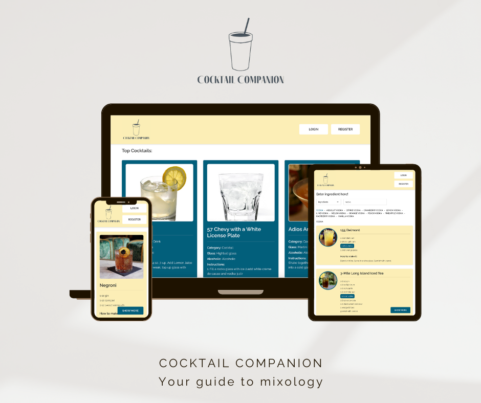

# Cocktail Companion

Cocktail Companion is a responsive web application designed to be your ultimate guide to the world of cocktails.

With Cocktail Companion, you can easily search for cocktails by ingredient or name, explore detailed recipes, and curate your own library of favorite cocktails.

Our user-friendly interface makes it a breeze to discover and enjoy the art of mixology.



## Getting started:
1. Clone the repo:

   ```bash
      git clone https://github.com/RiccardoMurru/Cocktail-Companion.git
      cd cocktail-companion
    ```
2. Install the dependencies and run the server:

   ```bash
      cd server && npm install
      npx ts-node index.ts
    ```
3. Install the dependencies and run the client:

   ```bash
      cd client && npm install
      npm run dev
    ```

## External API:

Cocktail Companion uses The Cocktail DB API, for endpoints/instructions visit [The Cocktail DB](https://www.thecocktaildb.com/api.php) site.

## Tech stack:

Cocktail companion is built whith:
- [React](https://react.dev/)
- [Vite](https://vitejs.dev/)
- [TypeScript](https://www.typescriptlang.org/)
- [Express](https://expressjs.com/)
- [Mongo DB](https://www.mongodb.com/)
- [Mongoose](https://mongoosejs.com/)

## The team:

Based on Eduard Draghiciu's codebase: [GitHub](https://github.com/Eduardcodes) - [Linkedin](https://www.linkedin.com/in/eduard%2Ddraghiciu/)

- Riccardo Murru: [GitHub](https://github.com/RiccardoMurru) - [Linkedin](https://www.linkedin.com/in/riccardomurru/)
- Patricia Bárcena: [GitHub](https://github.com/patri27) - [Linkedin](https://www.linkedin.com/in/patricia-barcena-bescansa/)
- Hong Nhung Pham: [GitHub](https://github.com/Rosalina1309) - [Linkedin](https://www.linkedin.com/in/hongnhungpham1309/)
